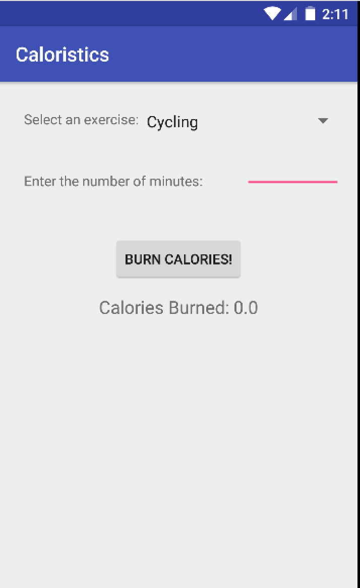
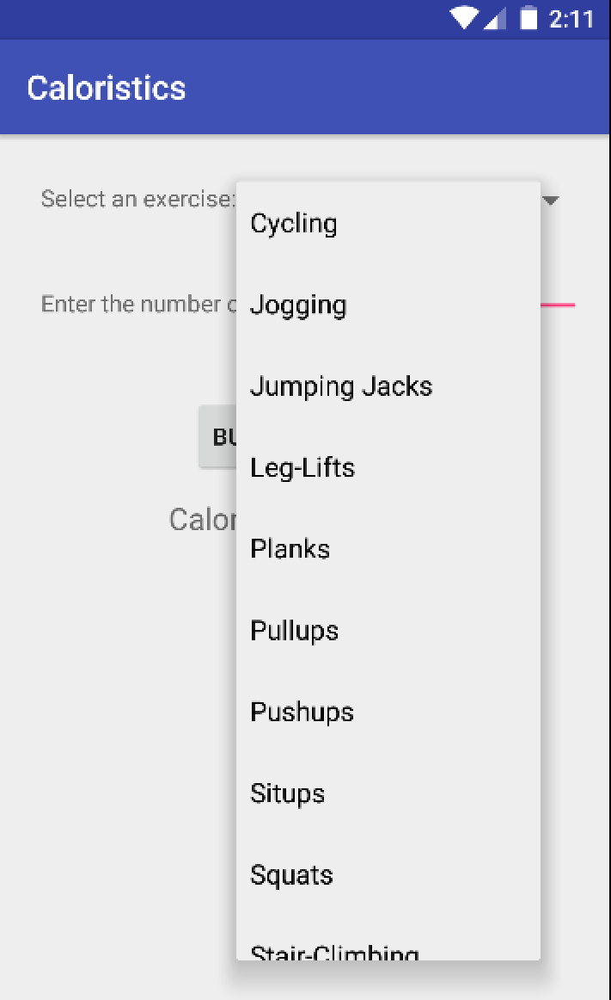
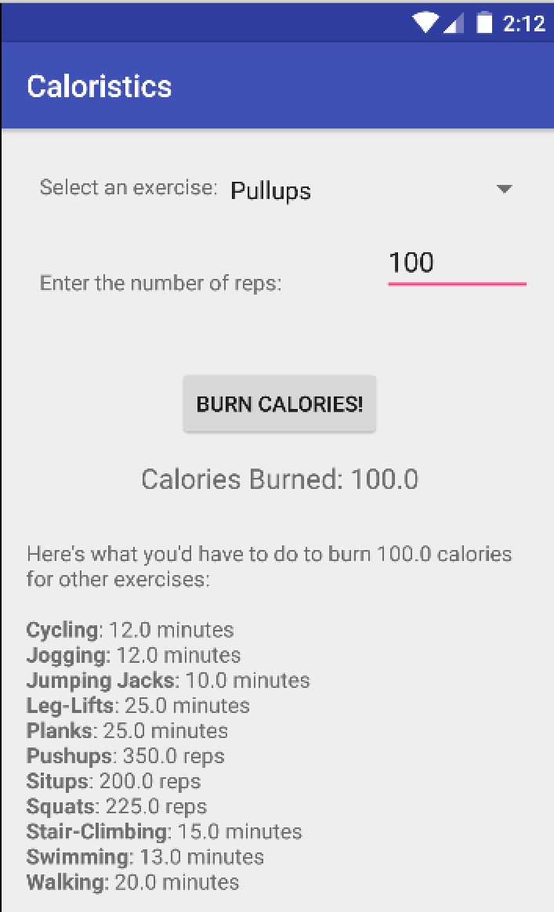
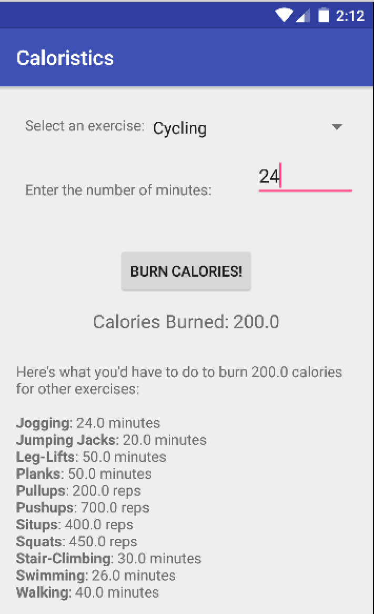
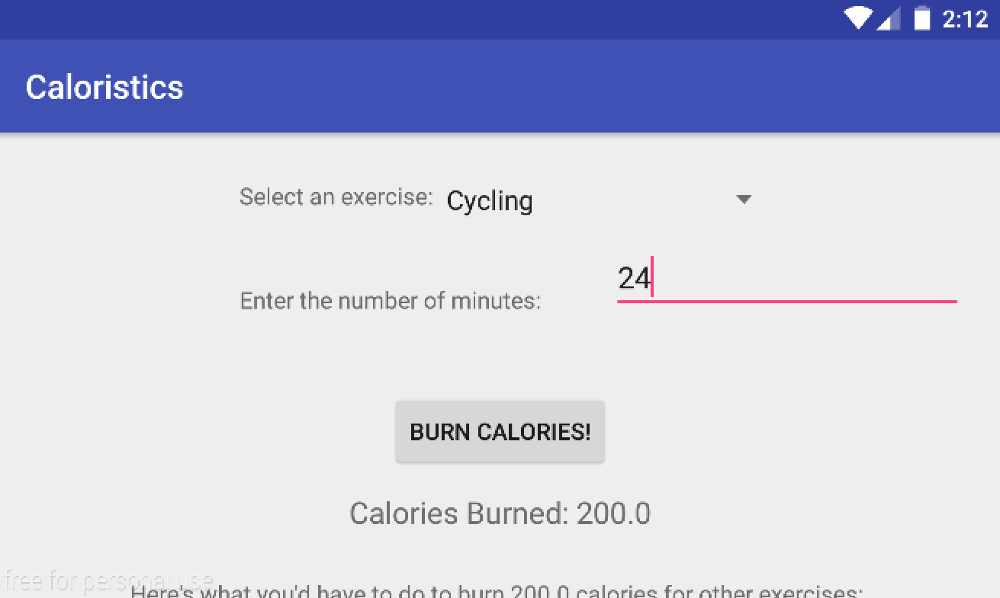

# CALORISTICS 
### PROG 01: Crunch Time

The purpose of the Caloristics Android application is to give users quick information about how many calories they have burned from doing their favorite exercises. 

Depending on the exercise, users can enter in either the number of minutes they have spent or the amount of repetitions performed on an exercise to see how many calories they have burned. They will also see a comparison to other exercises, so that they know how much work they would have had to do in order to burn that many calories doing another activity.

#### Home Screen
The entirety of the Caloristics application can be seen on the home screen:

#### Exercise Selection
Users can select their desired exercise from the drop down box:

#### Example Calculations
If the user selects a rep-based exercise (such as Pullups, Pushups, Situps, or Squats), Caloristics will automatically recognize that the user input is in reps and not minutes. This can be seen by the text: "Enter the number of reps:". The user should then enter in the number of reps they did.

After the user has selected their desired exercise, they can hit the "BURN CALORIES!" button, which will calculate how many calories the user burned from their specified reps and exercise. Additionally, they will see a comparison list of all of the other exercises, showing them how many reps or minutes of each exercise they would have to do in order to burn the equivalent amount of calories.

If the user selects a minute-based exercise (such as Cycling, Jogging, Jumping Jacks, Leg-Lifts, Planks, Stair-Climbing, or Swimming), Caloristics will automatically recognize that the user input is in minutes and not reps. This can be seen by the text: "Enter the number of minutes:". The user should then enter in the number of minutes of exercise they did before hitting the "BURN CALORIES!" button.

#### Landscape View
Caloristics supports screen rotation into landscape view. Everything is properly preserved when the screen rotates. Overflowing content is also scrollable.

## Supported Devices

Caloristics has only been tested on Android 5.1 Lollipop on a Google Nexus 5 through a Genymotion emulator.

## Available Exercises

Caloristics allows calorie calculations for the following exercises:

* Cycling
* Jogging
* Jumping Jacks
* Leg-Lifts
* Planks
* Pullups
* Pushups
* Situps
* Squats
* Stair-Climbing
* Swimming
* Walking

## .APK File
Find the .apk file [here] (https://github.com/cs160-sp16/prog-01-crunch-time-daltonboll/tree/master/Caloristics/app/build/outputs/apk).

## Acknowledgments

* Thank you to the example code in [Head First Android] (http://shop.oreilly.com/product/0636920029045.do) 
